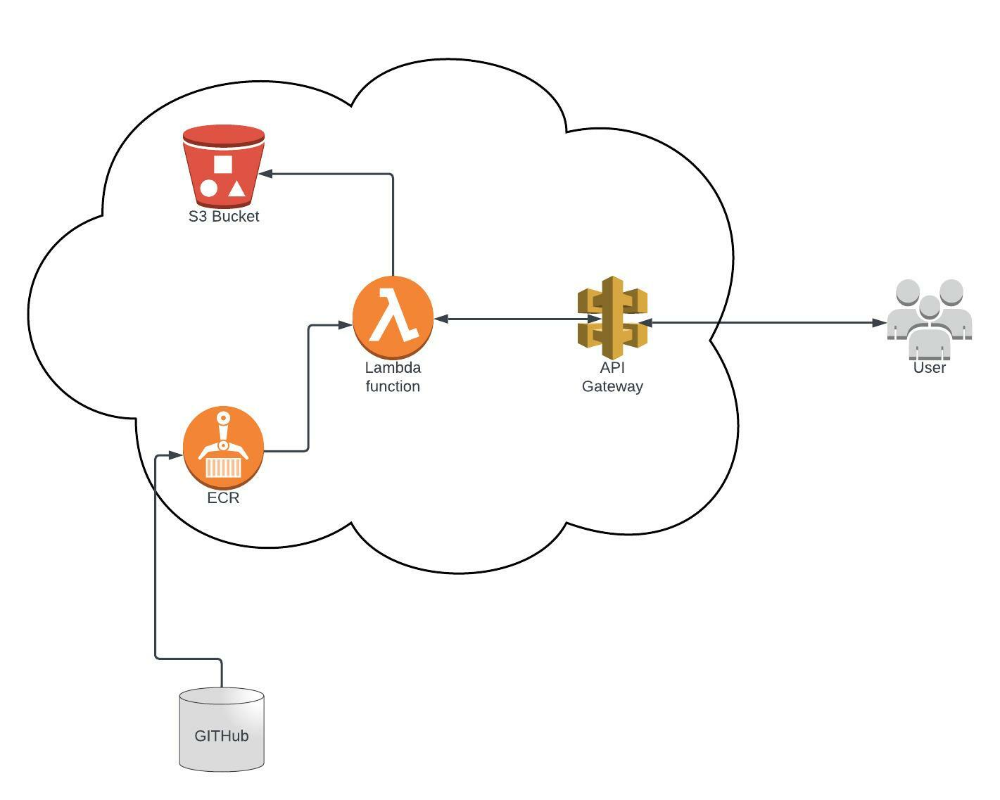

# Lambda-test

This is repo contains all the needed code to deploy an image resize application (NodeJS) into AWS through CloudFormation.

## Basic components

The solution is based in different components. In the AWS part, the first one is the ECR, is where the images of the code are stored. That images are executed by a lambda function which it's configured to pick up the latest version. To execute it, API Gateway has been configured as a proxy, in a way that the users can make their requests directly to it. Finally, the lambda stores the result of the execution in an S3 Bucket.

## Extras

As an extra, everything is logged into CloudWatch, and the traces are configured in XRay. The API Gateway has an authentication configured, based in IAM policies + users. And a pipeline is configured in GitHub actions to automatically deploy a newer version of the application code when a branch is merged.